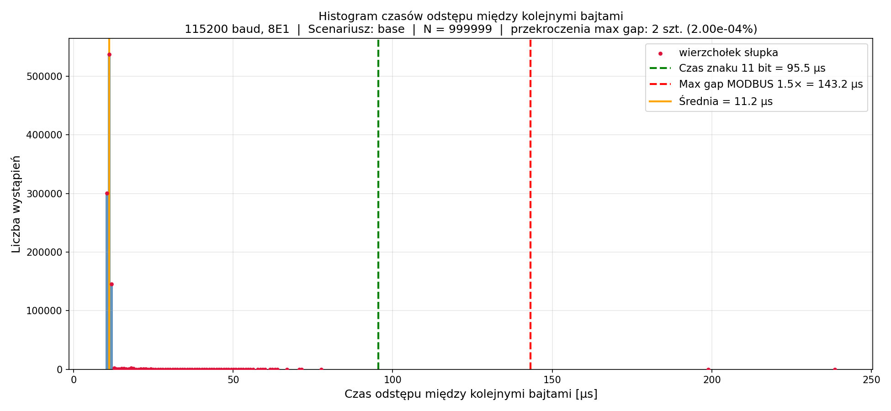

# system-rts-impact

Pomiar wpływu systemu operacyjnego macOS na terminowość transmisji szeregowej w protokole MODBUS RTU.
Projekt realizuje zadania 2A i 2B z laboratorium *Systemy czasu rzeczywistego* (EiTI PW).

## Wymagania wstępne

- macOS
- Python ≥ 3.11
- [`uv`](https://github.com/astral-sh/uv) — menedżer pakietów Python
- [Nix](https://nixos.org/download/) — do uruchamiania `socat` bez instalacji systemowej

## Instalacja

```bash
git clone <repo-url>
cd system-rts-impact
uv sync
```

## Uruchomienie

Skrypty `run_pomiar_2a.sh` i `run_pomiar_2b.sh` automatycznie uruchamiają `socat` przez Nix,
tworzą wirtualną parę portów PTY i wykonują pomiar.

**Zadanie 2A** — ciągła transmisja bajtu `0xC4`, pomiar odstępów między kolejnymi znakami:

```bash
bash run_pomiar_2a.sh
```

**Zadanie 2B** — ciągła transmisja ramki MODBUS RTU `01 03 00 00 00 02 C4 0B`,
metoda zastępcza (T_ramka / 8):

```bash
bash run_pomiar_2b.sh
```

Skrypt zapyta interaktywnie o liczbę próbek, etykietę scenariusza i katalog wyjściowy.
Po zakończeniu histogram zapisywany jest jako `histogram_<etykieta>.png`.

## Parametry transmisji

| Parametr | Wartość |
|----------|---------|
| Baudrate | 115 200 bps |
| Format | 8E1 (8 bitów danych, parzystość parzysta, 1 bit stopu) |
| Port | wirtualny PTY (socat) |
| Max gap MODBUS RTU | 143,23 µs (1,5 × czas znaku) |

## Przykładowy wynik

Pomiar bazowy (aplikacje zamknięte, metoda indywidualna, N = 10⁶ − 1):



## Struktura projektu

```
├── zadanie2a.py          skrypt pomiarowy — bajt 0xC4
├── zadanie2b.py          skrypt pomiarowy — ramka MODBUS RTU
├── shared.py             wspólne stałe i funkcje (statystyki, histogram)
├── run_pomiar_2a.sh      skrypt uruchamiający zadanie 2A
├── run_pomiar_2b.sh      skrypt uruchamiający zadanie 2B
├── shared.sh             wspólna logika shell (socat, PTY, cleanup)
├── pyproject.toml        zależności projektu
└── .raport/              sprawozdanie LaTeX + histogramy
```
